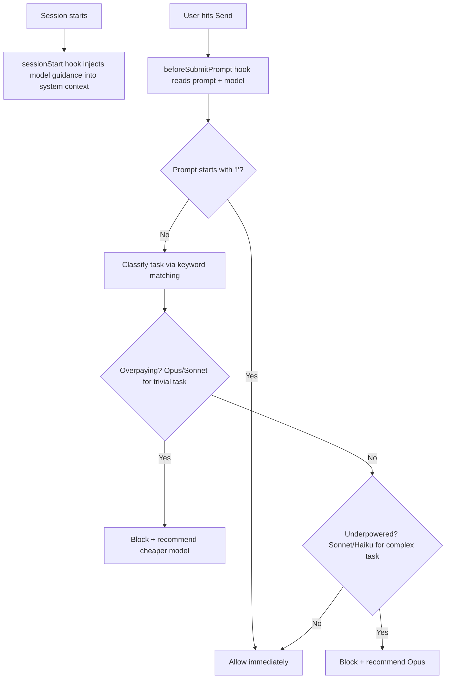

# Model Matchmaker

**Stop paying Opus prices to rename files. Stop waiting 20 seconds for responses that should take 3.**

A local hook for [Cursor](https://cursor.com) and [Claude Code](https://docs.anthropic.com/en/docs/claude-code) that classifies every prompt before it's sent and recommends the right model. Saves money (cloud APIs), speeds up your workflow (everyone), reduces resource usage (local models). No proxy, no API calls, no dependencies. Three files, two minutes to set up.

## What It Does

Before each prompt is sent, Model Matchmaker reads what you're asking and which model you're on, then makes a call:

- **Step-down**: You're on Opus asking to `git commit`? Blocked. "Switch to Haiku, same result, 90% cheaper."
- **Step-up**: You're on Sonnet asking about architecture tradeoffs? Blocked. "Switch to Opus, you need the horsepower."
- **Pass-through**: You're on the right model? Prompt goes through instantly.

Override anytime by prefixing your prompt with `!`.

## How It Works



Two layers work together:

1. **`session-init.sh`** runs at session start and injects model-awareness context so the AI itself knows when to suggest switching
2. **`model-advisor.sh`** runs before every prompt, classifies the task, and blocks with a recommendation when you're on the wrong model

## Quick Setup

```bash
# 1. Clone this repo (or just copy the files)
git clone https://github.com/coyvalyss1/model-matchmaker.git

# 2. Copy files to your Cursor config
cp model-matchmaker/hooks.json ~/.cursor/
mkdir -p ~/.cursor/hooks
cp model-matchmaker/hooks/*.sh ~/.cursor/hooks/

# 3. Make scripts executable
chmod +x ~/.cursor/hooks/session-init.sh ~/.cursor/hooks/model-advisor.sh

# 4. Restart Cursor (or Claude Code)
```

That's it. No packages, no build step, no config files to edit.

## What Gets Routed Where

| Model | Task Type | Patterns |
|-------|-----------|----------|
| **Haiku** | Mechanical, simple | `git commit`, `git push`, `rename`, `reorder`, `move file`, `delete file`, `add import`, `format`, `lint`, `prettier`, `eslint` |
| **Sonnet** | Implementation | `build`, `implement`, `create`, `fix`, `debug`, `add feature`, `write`, `component`, `service`, `page`, `deploy`, `test`, `refactor` |
| **Opus** | Architecture, analysis | `architect`, `evaluate`, `tradeoff`, `strategy`, `deep dive`, `redesign`, `across the codebase`, `multi-system`, `analyze`, `rethink` |

Opus is also recommended for prompts over 200 words or analytical questions over 100 words.

The classifier is **conservative**: it only blocks when confidence is high. A false allow (wasting some money) is always better than a false block (interrupting your flow with a wrong recommendation).

## Sample Log Output

Every decision is logged to `~/.cursor/hooks/model-advisor.log`:

```
[2026-03-03 14:22:01] model=claude-4-opus rec=haiku action=BLOCK prompt="git commit all chang..."
[2026-03-03 14:23:15] model=claude-4-opus rec=sonnet action=BLOCK prompt="build a new componen..."
[2026-03-03 14:25:44] model=claude-4-sonnet rec=opus action=BLOCK prompt="evaluate the tradeof..."
[2026-03-03 14:30:02] model=claude-4-sonnet rec=uncertain action=ALLOW prompt="what time zone is Ne..."
```

The log only captures the first 20 characters of each prompt (for privacy) plus the model, recommendation, and whether it blocked or allowed. Useful for tuning the patterns to your workflow.

## Override

Prefix any prompt with `!` to bypass the advisor entirely:

```
! just do it on Opus, I know what I'm doing
```

The hook returns immediately with no classification.

## How This Compares to Other Solutions

### Cursor's Auto Mode

Cursor's Auto mode runs server-side and picks from a curated shortlist (GPT-4.1, Claude 4 Sonnet, Gemini 2.5 Pro). A few limitations:

- It doesn't include Opus or Haiku, so it can't route to the cheapest or most powerful option
- It doesn't show you which model it picked
- Independent testing shows it mostly routes to Sonnet regardless of task complexity
- It optimizes for Cursor's infrastructure costs, not necessarily your output quality

Model Matchmaker is a complementary local layer that works on top of whatever model you've selected, nudging you in both directions: down when you're overpaying, up when you're underpowered.

### OpenRouter's /auto Endpoint

OpenRouter's `/auto` is server-side routing between models they host. Key difference:

**OpenRouter/auto:**
- Runs on their servers (after your request is sent)
- Routes between models they host
- You still pay per token (just optimized pricing)
- Only works with OpenRouter

**Model Matchmaker:**
- Runs on your machine (before the request is sent)
- Blocks unnecessary requests entirely (no API call = no cost)
- Works with any provider (Claude, OpenRouter, local models, etc.)
- Saves time AND money (smaller models respond 3-5x faster)

Think of it as two layers: Model Matchmaker prevents unnecessary requests client-side, OpenRouter/auto optimizes server-side routing. You could even use both together.

## Why Not a Proxy?

Proxy-based routing (custom proxy servers, ClawRouter, etc.) introduces real risks:

- 91,000+ attack sessions targeting LLM proxy endpoints were detected between Oct 2025 and Jan 2026
- API keys can leak via DNS exfiltration before HTTP-layer tools even see them
- A proxy crash means zero AI access until restarted
- You lose Cursor's built-in streaming, caching, and error handling

Model Matchmaker runs entirely locally. No network calls, no proxy, no attack surface.

## Design Decisions

- **Pure bash + python3** for JSON parsing. No external dependencies. python3 is pre-installed on macOS and most Linux.
- **2-second timeout**. If the script hangs, Cursor proceeds normally (fail-open). You're never locked out.
- **Local logging only**. Timestamp, model, recommendation, and a 20-char prompt snippet. No full prompts stored.
- **No LLM calls for classification**. Instant, free, deterministic. Keyword matching is fast and predictable.
- **No network calls**. Everything is local string matching. Nothing leaves your machine.

## Results

I ran a retroactive analysis on several weeks of prompts from building two products ([DoMoreWorld](https://domoreworld.com) and [Art Ping Pong](https://artpingpong.com)). I was using Opus for almost everything.

### Cost Savings (Cloud API Users)
- **60-70% of prompts** were standard implementation work (building pages, writing components, debugging) that Sonnet handles identically at ~75% less cost
- **Git commits, file renames, route additions, menu reordering** were all on Opus when Haiku handles them at ~90% less cost
- **Architecture decisions and deep analysis** correctly stayed on Opus
- **Estimated savings: 50-70%** of total AI spend with zero quality loss

### Speed Improvements (Everyone)
- **Haiku responds 3-5x faster than Opus** - routing 60% of requests to Haiku/Sonnet means your workflow feels noticeably more responsive
- **No more waiting 15-20 seconds** for Opus to process "git commit -m 'fix typo'"
- **Staying in flow** - when simple tasks return in 3-5 seconds instead of 15-20, you maintain momentum

### Resource Efficiency (Local Model Users)
While this tool is configured for Claude models out-of-the-box, the routing logic applies to local models too:
- **VRAM savings**: Don't load Llama 70B (40GB) for tasks that work fine on Llama 8B (5GB)
- **Inference speed**: Smaller models respond faster (2 seconds vs. 10 seconds)
- **Power/heat**: Lighter models = lower electricity bills, less fan noise
- **Adaptable**: Since it's open source, you can easily swap model names in the config for your local stack (Ollama, LM Studio, etc.)

### Accuracy
- **12/12 test prompts** from real sessions classified correctly after tuning
- The log file has been the most interesting part - reviewing it reveals patterns you don't expect; most "build" prompts genuinely don't need Opus

## Contributing

Open an issue or PR if you want to add patterns, tune the classifier, or add support for other editors. The keyword lists in `model-advisor.sh` are the main thing to tweak.

## License

MIT
