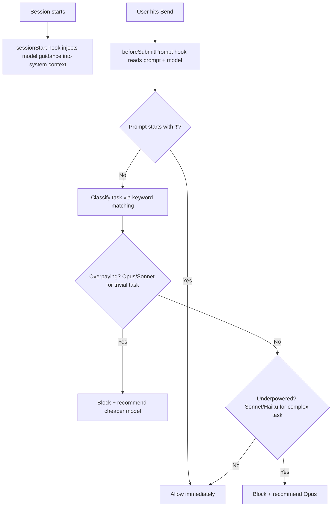

# Model Matchmaker

**Stop paying Opus prices to rename files. Stop waiting 20 seconds for responses that should take 3.**

A local hook for [Cursor](https://cursor.com) and [Claude Code](https://docs.anthropic.com/en/docs/claude-code) that classifies every prompt before it's sent and recommends the right model. Saves money (cloud APIs), speeds up your workflow (everyone), reduces resource usage (local models). No proxy, no API calls, no dependencies. Three files, two minutes to set up.

## What It Does

Before each prompt is sent, Model Matchmaker reads what you're asking and which model you're on, then makes a call:

- **Step-down**: You're on Opus asking to `git commit`? Blocked. "Switch to Haiku, same result, 90% cheaper."
- **Step-up**: You're on Sonnet asking about architecture tradeoffs? Blocked. "Switch to Opus, you need the horsepower."
- **Pass-through**: You're on the right model? Prompt goes through instantly.

Override anytime by prefixing your prompt with `!`.

### Auto-Switch (Optional)

Enable automatic model switching (v2+):
```bash
~/.cursor/hooks/toggle-auto-switch.sh on
```

When Model Matchmaker blocks a prompt, it now **automatically switches the model and submits your message** via keyboard automation:
1. Opens the model dropdown (Cmd+/)
2. Types the model name to search
3. Presses Enter 3 times (select model, confirm, submit message)
4. Terminal window flashes briefly, then closes
5. Your message is sent with the correct model (~3-4 seconds total)

Check status:
```bash
~/.cursor/hooks/toggle-auto-switch.sh status
```

Disable anytime with `off`. Uses macOS Accessibility permissions + Terminal.app proxy for safe, reliable switching.

**Mode Support:**  
Auto-switch adapts to Cursor's different modes (Agent, Plan, Debug, Ask). In Plan mode, Haiku is unavailable, so Model Matchmaker automatically switches to Sonnet instead. To log your current mode:

```bash
~/.cursor/hooks/log-cursor-mode.sh plan   # When entering Plan mode
~/.cursor/hooks/log-cursor-mode.sh agent  # When back in Agent mode
```

This ensures correct dropdown navigation for each mode.

## How It Works



Three layers work together:

1. **`session-init.sh`** runs at session start and injects model-awareness context so the AI itself knows when to suggest switching
2. **`model-advisor.sh`** runs before every prompt, classifies the task, and blocks with a recommendation when you're on the wrong model
3. **`track-completion.sh`** runs when the agent loop ends, logging task outcomes for accuracy analysis

## Quick Setup

```bash
# 1. Clone this repo (or just copy the files)
git clone https://github.com/coyvalyss1/model-matchmaker.git

# 2. Copy files to your Cursor config
cp model-matchmaker/hooks.json ~/.cursor/
mkdir -p ~/.cursor/hooks
cp model-matchmaker/hooks/*.sh ~/.cursor/hooks/

# 3. Make scripts executable
chmod +x ~/.cursor/hooks/*.sh

# 4. Restart Cursor (or Claude Code)
```

That's it. No packages, no build step, no config files to edit.

### Enable Auto-Switch (Optional)

Model Matchmaker v2+ can automatically switch models when it blocks a prompt:

```bash
# Grant Accessibility permissions first
# System Settings > Privacy & Security > Accessibility > Add Terminal

# Then enable auto-switch
~/.cursor/hooks/toggle-auto-switch.sh on

# Check status
~/.cursor/hooks/toggle-auto-switch.sh status

# Disable anytime
~/.cursor/hooks/toggle-auto-switch.sh off
```

When enabled, the model switches and submits automatically (~3-4 seconds) instead of showing a block message.

**Security:** Auto-switch uses input whitelisting, rate limiting, atomic locking, frontmost verification, and scoped keyboard shortcuts to ensure it can only type one of three model names into Cursor's dropdown—nothing more. See [SECURITY.md](SECURITY.md) for full details.

**Customization:** The default whitelist includes `haiku`, `sonnet`, and `opus`. To use other models (GPT-4, Gemini, local models), edit `~/.cursor/hooks/auto-switch-model.sh` lines 36-42:

```bash
case "$MODEL" in
    haiku|sonnet|opus|gpt-4|gemini)  # Add your models here
        ;;
    *)
        echo "[$(date -Iseconds)] SECURITY: Invalid model rejected: $MODEL" >> "$LOG_FILE"
        exit 1
        ;;
esac
```

Also update the classifier in `model-advisor.sh` to recommend your custom models.

## What Gets Routed Where

| Model | Task Type | Patterns |
|-------|-----------|----------|
| **Haiku** | Mechanical, simple | `git commit`, `git push`, `rename`, `reorder`, `move file`, `delete file`, `add import`, `format`, `lint`, `prettier`, `eslint` |
| **Sonnet** | Implementation | `build`, `implement`, `create`, `fix`, `debug`, `add feature`, `write`, `component`, `service`, `page`, `deploy`, `test`, `refactor` |
| **Opus** | Architecture, analysis | `architect`, `evaluate`, `tradeoff`, `strategy`, `deep dive`, `redesign`, `across the codebase`, `multi-system`, `analyze`, `rethink` |

Opus is also recommended for prompts over 200 words or analytical questions over 100 words.

The classifier is **conservative**: it only blocks when confidence is high. A false allow (wasting some money) is always better than a false block (interrupting your flow with a wrong recommendation).

## Analytics

Model Matchmaker tracks every recommendation, override, and task completion in structured NDJSON logs at `~/.cursor/hooks/model-matchmaker.ndjson`.

### What's Tracked

| Event | Data Captured |
|-------|--------------|
| **Recommendation** | Model used, recommendation, action (ALLOW/BLOCK/OVERRIDE), conversation ID, prompt snippet (40 chars) |
| **Override** | Same as recommendation, but action = OVERRIDE. Captures what was recommended vs. what you chose |
| **Completion** | Task outcome (completed/errored/aborted), model used, conversation ID |

Conversation IDs link recommendations to outcomes, so you can measure whether overriding the advisor led to better or worse results.

### View Your Stats

```bash
# Summary dashboard
./hooks/analytics.sh

# Last 7 days only
./hooks/analytics.sh --days 7

# JSON output (for scripting/dashboards)
./hooks/analytics.sh --json
```

Sample output:

```
==================================================
  MODEL MATCHMAKER ANALYTICS
  847 recommendations tracked
==================================================

  Actions:
       ALLOW:  512 (60.4%)
       BLOCK:  298 (35.2%)
    OVERRIDE:   37 ( 4.4%)

  Override rate: 4.4%
  Block rate:    35.2%

  Override breakdown (you disagreed):
    claude-4-sonnet (rec: opus): 22
    claude-4-opus (rec: haiku): 15

  Task Outcomes (312 conversations):
    Completed: 287
    Errored:   18
    Aborted:   7

  Override Outcomes:
    Completed after override: 33
    Errored after override:   4
==================================================
```

A high override rate with good completion outcomes means the classifier needs tuning for your workflow. A high override rate with errors means the advisor was probably right.

### Four-Tier Data Strategy

Model Matchmaker gives you four levels of analytics, each with different privacy and sharing boundaries:

**Tier 1: Automatic Local Logs (Default)**
- Full NDJSON logs with all data: `~/.cursor/hooks/model-matchmaker.ndjson`
- Includes: conversation IDs, prompt snippets (40 chars), model info, outcomes
- **Privacy: Local only, never leaves your machine**
- **Use case: Your personal workflow analysis**

**Tier 2: Personal Optimization (`skills/optimize-classifier/SKILL.md`)** ⭐ Recommended
- Analyzes your override patterns and auto-tunes your local classifier
- Finds keywords from prompts where you disagreed with the advisor
- Proposes changes to `model-advisor.sh` to match your preferences
- **Privacy: Completely local, no data leaves your machine**
- **Use case: Make your classifier learn from your overrides**
- Run this after 50+ prompts and a few overrides to tune it to your workflow

**Tier 3: Personal Dashboard (`analytics.sh`)**
- Aggregated stats from your logs: override rate, completion outcomes, patterns
- Run: `./hooks/analytics.sh` or `./hooks/analytics.sh --days 7`
- **Privacy: Local only, no sharing**
- **Use case: Track your own accuracy, identify classifier gaps**

**Tier 4: Community Contribution (Optional, User-Reviewed)**
- Sanitized report generated via Cursor skill: `skills/share-analytics/SKILL.md`
- AI-powered sanitization: removes project names, file paths, personal details
- Prompts → generic categories: "ui bug fix", "feature build", "API integration"
- **Privacy: You review and approve before sharing**
- **Use case: Help improve the classifier for everyone**
- **Note: Not required for personal optimization** (use Tier 2 instead)

The core workflow is: **Use Model Matchmaker → Review dashboard → Optimize locally → (Optionally) contribute anonymized data.**

Most users will only need Tiers 1-3. Tier 4 is if you want to help improve the community classifier.

### Privacy

- Only the first 40 characters of each prompt are stored (for pattern analysis)
- All data stays local in `~/.cursor/hooks/model-matchmaker.ndjson`
- No network calls, no telemetry, no cloud storage
- Delete the file anytime to clear your history

## Override

Prefix any prompt with `!` to bypass the advisor entirely:

```
! just do it on Opus, I know what I'm doing
```

The override is logged (so you can track accuracy) but the prompt goes through immediately with no blocking.

## Skills

Model Matchmaker includes optional Cursor Agent skills that extend its functionality:

### Context Monitor (`skills/context-monitor/SKILL.md`) 🆕

**Problem:** Cursor's MAX mode (Claude Opus 3.5, 200K token context) triggers automatically when context exceeds 200K tokens. Due to the larger context window, MAX mode requests can consume significantly more credits than typical requests.

**Solution:** Proactive context monitoring that warns before MAX mode triggers and helps you stay under the 200K limit.

**How it works:**
- 🟡 **100K tokens**: Notes internally, continues normally
- 🟠 **150K tokens**: Warns and suggests wrapping up or starting fresh chat
- 🔴 **180K tokens**: Recommends new chat immediately, offers handoff summary

**Auto-triggers warnings when:**
- Opening large files (>3,000 lines)
- Multiple large files in context (>5 files over 1,000 lines)
- Long conversations (>50 tool calls)
- Reading agent transcripts or logs

**Key feature: Handoff Summaries**

When recommending a new chat, the skill auto-generates a concise handoff summary:
- One-line task description
- Progress bullets (what's done)
- Next steps (numbered action items)
- @file references (what files need work)
- Critical context (1-2 sentences)

**Example:**
```markdown
## Handoff Summary for New Chat

**Task**: Fix chat component short-response fallback bug

**Progress**:
- Identified root cause: validation guard blocking saves
- Removed guard from useChatManager.jsx
- Added fallback examples to API helper

**Next Steps**:
1. Test save flow with empty data
2. Verify data structure generation
3. Deploy to production

**Key Files**:
- @src/hooks/useChatManager.jsx — Removed guard
- @server/helpers/apiHelper.js — Added examples

**Context**: Short-response fallback was a symptom, not root cause.
```

**Installation:**

Copy the skill to your `.cursor/skills/` directory:
```bash
cp -r ~/model-matchmaker/skills/context-monitor ~/.cursor/skills/
```

Then add this to your `.cursorrules` (after any "Prior Session Context" section):

```markdown
## MAX Mode Prevention & Context Monitoring

Monitor conversation context to avoid triggering MAX mode (200K token limit). See `.cursor/skills/context-monitor/SKILL.md` for full details.

**Token Thresholds:**
- 🟡 100K tokens: Note internally
- 🟠 150K tokens: Warn user, suggest wrapping up
- 🔴 180K tokens: Recommend new chat, offer handoff summary

**High-cost files (auto-warn when opened):**
- Any file >5,000 lines
- Multiple files >1,000 lines each
- Agent transcripts or logs

**When recommending new chat**, generate handoff summary with task description, progress, next steps, and @file references.
```

**Expected Impact:**

Based on typical usage patterns where large file operations push context to 150-180K:
- Catch ~50% of MAX triggers before they happen
- Reduce unnecessary context bloat
- Significant credit savings for users who frequently work with large files

**Works with Model Matchmaker:** Context Monitor helps you avoid MAX mode charges, while Model Matchmaker helps you avoid paying Opus prices for Haiku tasks. Together they optimize both context size and model selection.

### Other Skills

See the `skills/` directory for:
- **optimize-classifier**: Auto-tune the classifier from your override patterns
- **share-analytics**: Generate sanitized reports for community contribution

## Troubleshooting

### Auto-Switch Selects Wrong Model (Plan/Agent Mode)

**Symptom:** Auto-switch tries to select Haiku in Plan mode, or lands on the wrong model position.

**Cause:** Cursor's model dropdown changes based on mode — in Plan mode, Haiku is grayed out and gets skipped when arrow-keying, shifting all positions after it.

**Fix:** Log your current mode:
```bash
~/.cursor/hooks/log-cursor-mode.sh plan   # Entering Plan mode
~/.cursor/hooks/log-cursor-mode.sh agent  # Back to Agent mode
```

Auto-switch reads `~/.cursor/hooks/.cursor-mode` and adjusts dropdown positions accordingly. In Plan mode, Haiku requests automatically redirect to Sonnet.

### Hook Blocks Every Prompt (Exit Code 2 Error)

**Symptom:** After installing or updating Model Matchmaker, every prompt gets silently blocked. You can't send any messages in Cursor.

**Cause:** The `beforeSubmitPrompt` hook script has a syntax error (usually bash quoting issues) and exits with code 2, which Cursor interprets as "block this prompt."

**Quick Fix:**
1. Open `~/.cursor/hooks.json`
2. Remove or comment out the `beforeSubmitPrompt` section:
   ```json
   {
     "version": 1,
     "hooks": {
       "sessionStart": [
         { "command": "./hooks/session-init.sh", "timeout": 2 }
       ],
       // "beforeSubmitPrompt": [
       //   { "command": "./hooks/model-advisor.sh", "timeout": 2 }
       // ],
       "stop": [
         { "command": "./hooks/track-completion.sh", "timeout": 2 }
       ]
     }
   }
   ```
3. Restart Cursor (or just start a new composer session)

**Root Cause & Prevention:**

The `model-advisor.sh` script embeds Python code inside a bash `python3 -c '...'` heredoc. Certain Python string operations break bash's quoting:

**BAD (breaks bash):**
```python
snippet = prompt[:40].replace("\n", " ").replace("\"", "'")
# The \" inside single-quoted bash string confuses the parser
```

**GOOD (safe for bash):**
```python
snippet = prompt[:40].replace(chr(10), " ").replace(chr(34), chr(39))
# Using chr() avoids all quoting conflicts
```

**General rule:** Inside `python3 -c '...'`, avoid:
- Escaped double quotes (`\"`)
- Backslash escapes (`\n`, `\t`, etc.) - use `chr()` instead
- Single quotes in Python strings - use `chr(39)` or double quotes

**Test your hook:**
```bash
echo '{"prompt":"test","model":"claude-4-opus"}' | bash ~/.cursor/hooks/model-advisor.sh
```

If you see `{"continue": true}` or `{"continue": false, "user_message": "..."}`, it's working. If you see bash errors, check your quoting.

## How This Compares to Other Solutions

### Cursor's Auto Mode

Cursor's Auto mode runs server-side and picks from a curated shortlist (GPT-4.1, Claude 4 Sonnet, Gemini 2.5 Pro). A few limitations:

- It doesn't include Opus or Haiku, so it can't route to the cheapest or most powerful option
- It doesn't show you which model it picked
- Independent testing shows it mostly routes to Sonnet regardless of task complexity
- It optimizes for Cursor's infrastructure costs, not necessarily your output quality

Model Matchmaker is a complementary local layer that works on top of whatever model you've selected, nudging you in both directions: down when you're overpaying, up when you're underpowered.

### OpenRouter's /auto Endpoint

OpenRouter's `/auto` is server-side routing between models they host. Key difference:

**OpenRouter/auto:**
- Runs on their servers (after your request is sent)
- Routes between models they host
- You still pay per token (just optimized pricing)
- Only works with OpenRouter

**Model Matchmaker:**
- Runs on your machine (before the request is sent)
- Blocks unnecessary requests entirely (no API call = no cost)
- Works with any provider (Claude, OpenRouter, local models, etc.)
- Saves time AND money (smaller models respond 3-5x faster)

Think of it as two layers: Model Matchmaker prevents unnecessary requests client-side, OpenRouter/auto optimizes server-side routing. You could even use both together.

## Why Not a Proxy?

Proxy-based routing (custom proxy servers, ClawRouter, etc.) introduces real risks:

- 91,000+ attack sessions targeting LLM proxy endpoints were detected between Oct 2025 and Jan 2026
- API keys can leak via DNS exfiltration before HTTP-layer tools even see them
- A proxy crash means zero AI access until restarted
- You lose Cursor's built-in streaming, caching, and error handling

Model Matchmaker runs entirely locally. No network calls, no proxy, no attack surface.

## Design Decisions

- **Pure bash + python3** for JSON parsing. No external dependencies. python3 is pre-installed on macOS and most Linux.
- **2-second timeout**. If the script hangs, Cursor proceeds normally (fail-open). You're never locked out.
- **Structured NDJSON logging**. Every event is a JSON line with conversation IDs for correlation. First 40 chars of prompt only.
- **No LLM calls for classification**. Instant, free, deterministic. Keyword matching is fast and predictable.
- **No network calls**. Everything is local string matching. Nothing leaves your machine.
- **Override tracking**. When you bypass with `!`, the recommendation is still logged so you can measure classifier accuracy over time.

## Results

I ran a retroactive analysis on several weeks of prompts from building two products ([DoMoreWorld](https://domoreworld.com) and [Art Ping Pong](https://artpingpong.com)). I was using Opus for almost everything.

### Cost Savings (Cloud API Users)
- **60-70% of prompts** were standard implementation work (building pages, writing components, debugging) that Sonnet handles identically at ~75% less cost
- **Git commits, file renames, route additions, menu reordering** were all on Opus when Haiku handles them at ~90% less cost
- **Architecture decisions and deep analysis** correctly stayed on Opus
- **Estimated savings: 50-70%** of total AI spend with zero quality loss

### Speed Improvements (Everyone)
- **Haiku responds 3-5x faster than Opus** - routing 60% of requests to Haiku/Sonnet means your workflow feels noticeably more responsive
- **No more waiting 15-20 seconds** for Opus to process "git commit -m 'fix typo'"
- **Staying in flow** - when simple tasks return in 3-5 seconds instead of 15-20, you maintain momentum

### Resource Efficiency (Local Model Users)
While this tool is configured for Claude models out-of-the-box, the routing logic applies to local models too:
- **VRAM savings**: Don't load Llama 70B (40GB) for tasks that work fine on Llama 8B (5GB)
- **Inference speed**: Smaller models respond faster (2 seconds vs. 10 seconds)
- **Power/heat**: Lighter models = lower electricity bills, less fan noise
- **Adaptable**: Since it's open source, you can easily swap model names in the config for your local stack (Ollama, LM Studio, etc.)

### Accuracy
- **12/12 test prompts** from real sessions classified correctly after tuning
- The log file has been the most interesting part - reviewing it reveals patterns you don't expect; most "build" prompts genuinely don't need Opus
- Run `./hooks/analytics.sh` to see your personal accuracy metrics: override rate, completion outcomes after overrides, and recommendation distribution

## Contributing

Open an issue or PR if you want to add patterns, tune the classifier, or add support for other editors. The keyword lists in `model-advisor.sh` are the main thing to tweak.

### Writing Custom Hooks

If you're extending Model Matchmaker or writing your own Cursor hooks, here are guidelines to avoid the bash quoting trap that can lock users out:

**The Problem:** Hooks use `python3 -c '...'` to embed Python inside bash. The Python code runs inside a bash single-quoted string, so certain Python string operations break the quoting and cause exit code 2 (which Cursor interprets as "block this prompt").

**Safe patterns:**

```python
# Use chr() for special characters instead of escape sequences
newline = chr(10)   # instead of "\n"
quote = chr(34)     # instead of "\""
apostrophe = chr(39) # instead of "'"

# Safe string operations
snippet = text[:40].replace(chr(10), " ").replace(chr(34), chr(39))
```

**Unsafe patterns that break bash:**

```python
# These will cause syntax errors in the bash heredoc
snippet = text[:40].replace("\n", " ")  # Backslash escapes break
snippet = text[:40].replace("\"", "'")  # Escaped quotes break
snippet = text[:40].replace('"', "'")   # Raw quotes break
```

**Testing your hook:**

```bash
# Test with sample input
echo '{"prompt":"test message","model":"claude-4-opus"}' | bash ~/.cursor/hooks/your-hook.sh

# Should output valid JSON like:
# {"continue": true}
# or
# {"continue": false, "user_message": "Blocked because..."}

# If you see bash errors like "unexpected EOF", you have quoting issues
```

**General principles:**
- Use `chr()` for any character that could conflict with bash quoting
- Avoid f-strings with quotes inside them
- Test standalone before deploying to users
- Remember: exit code 2 = block, exit code 0 = success, other codes = fail-open (prompt proceeds)

---

## Claude Code Port

Claude Code exposes model, effort, and extended thinking as programmable parameters — no AppleScript or UI automation needed. This port uses a pre-launch classifier and a silent hook.

### How It Works

```
cc "redesign auth system"
  → reads cc-config.json
  → matches "architect" pattern → opus + effort:high + thinking:on
  → writes alwaysThinkingEnabled to settings.json
  → launches: ANTHROPIC_MODEL=opus CLAUDE_CODE_EFFORT_LEVEL=high claude
  → on exit: restores alwaysThinkingEnabled
```

**Architecture principle:** The classifier is pure bash regex. Claude never decides its own model or effort level.

### Quick Setup

```bash
# 1. Clone repo (if not already)
git clone https://github.com/coyvalyss1/model-matchmaker.git

# 2. Install scripts
cp model-matchmaker/cc-config.json ~/.claude/hooks/
cp model-matchmaker/hooks/cc-launch.sh ~/.claude/hooks/
cp model-matchmaker/hooks/cc-effort-advisor.sh ~/.claude/hooks/
cp model-matchmaker/hooks/mm-control.sh ~/.claude/hooks/
chmod +x ~/.claude/hooks/cc-launch.sh ~/.claude/hooks/cc-effort-advisor.sh

# 3. Add to ~/.claude/settings.json — inside the "hooks" block:
#    "PreToolUse": [
#      {
#        "matcher": "Agent",
#        "hooks": [{ "type": "command", "command": "bash ~/.claude/hooks/cc-effort-advisor.sh", "timeout": 3 }]
#      }
#    ]
#    Also set: "availableModels": ["haiku", "sonnet", "opus"]

# 4. Add to ~/.zshrc:
alias cc='~/.claude/hooks/cc-launch.sh'
source ~/.claude/hooks/mm-control.sh
```

### Usage

```bash
cc                               # default: sonnet + effort:low
cc "find all TODO comments"      # haiku + effort:low
cc "fix the login bug"           # sonnet + effort:medium
cc "redesign the auth system"    # opus + effort:high + thinking:on
```

### Customizing Rules

Edit `~/.claude/hooks/cc-config.json`:

```json
{
  "version": 1,
  "default": { "model": "sonnet", "effort": "low", "thinking": false },
  "rules": [
    {
      "name": "deep-work",
      "pattern": "architect|design system|audit|strategy",
      "model": "opus",
      "effort": "high",
      "thinking": true
    },
    {
      "name": "my-custom-rule",
      "pattern": "database|sql|query|schema",
      "model": "sonnet",
      "effort": "high",
      "thinking": false
    }
  ]
}
```

Rules match top-to-bottom; first match wins. `pattern` is a case-insensitive extended regex (`grep -iE`). Valid models: `haiku`, `sonnet`, `opus`. Valid effort: `low`, `medium`, `high`.

### Kill Switch

```bash
mm-off      # disable everything instantly
mm-on       # re-enable
mm-status   # show state, active rules, recent audit log
```

`mm-off` creates `~/.claude/hooks/.mm-kill` and saves a backup of the hook config. `mm-on` removes the kill switch and restores from backup.

### Audit Log

All launches log to `~/.claude/hooks/mm-audit.log` (NDJSON). Only the first 60 chars of prompts are retained. No network calls.

```json
{"ts":"...","event":"launch","rule":"deep-work","model":"opus","effort":"high","thinking":true,"hint":"redesign the auth system"}
{"ts":"...","event":"subagent","rule":"quick-lookup","model":"haiku","effort":"low","hint":"find all files matching *.test.js"}
```

### Differences from the Cursor Version

| | Cursor | Claude Code |
|---|---|---|
| Model enforcement | Hard block (UI) | Env var at launch (OS-level) |
| Effort control | Not available | `CLAUDE_CODE_EFFORT_LEVEL` |
| Thinking control | Not available | `alwaysThinkingEnabled` in settings.json |
| Mid-session switch | AppleScript | Not supported (set at launch) |
| Subagent routing | N/A | Silent PreToolUse hook |
| Config format | Hardcoded patterns | `cc-config.json` (user-editable) |

---

### Roadmap

**Active Development:**
- Local model support (Ollama, LM Studio, vLLM) - make the tool work with your local LLM stack, not just Claude

**Blocked on Cursor/Claude Code API:**
- Model prefix syntax (`haiku:`, `sonnet:`, `opus:` at prompt start) - requires per-request model override capability
- Plan mode activation prefix - requires programmatic UI state control

See [GitHub Issues](https://github.com/coyvalyss1/model-matchmaker/issues) for details and discussion.

## About

Built by Coy Byron ([Valyss LLC](https://business.valyss.com)).

Part of a collection of open-source AI development tools. Check out:
- [Multi-Product Context System](https://github.com/coyvalyss1/multi-product-context) - Stop explaining your codebase to AI every session

## License

MIT
